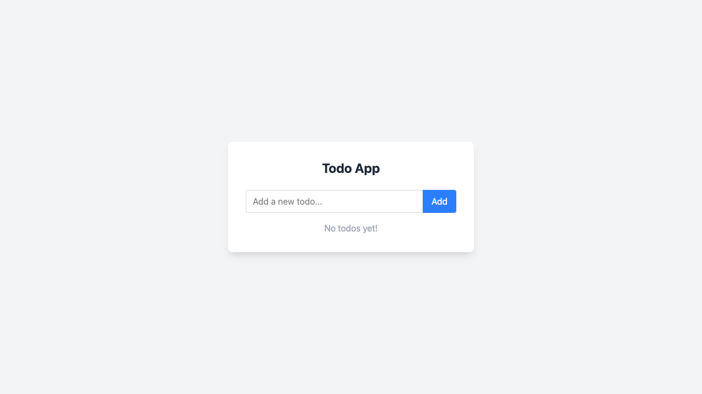

# Todo App

Welcome to the Todo App! This simple application helps you keep track of your tasks.

## Features
- **Add Todos:** Type your task in the input box and click the "Add" button (or press Enter) to add it to your list.
- **Complete Todos:** Click on a todo item to mark it as completed. Completed todos will appear with a line through them.
- **Delete Todos:** Click the red "×" button next to a todo to remove it from your list.

## User Interface

- The app displays your list of todos in a clean, modern card.
- If there are no todos, a message will let you know.
- All actions are instant and require no page reloads.

Enjoy staying organized with your Todo App!